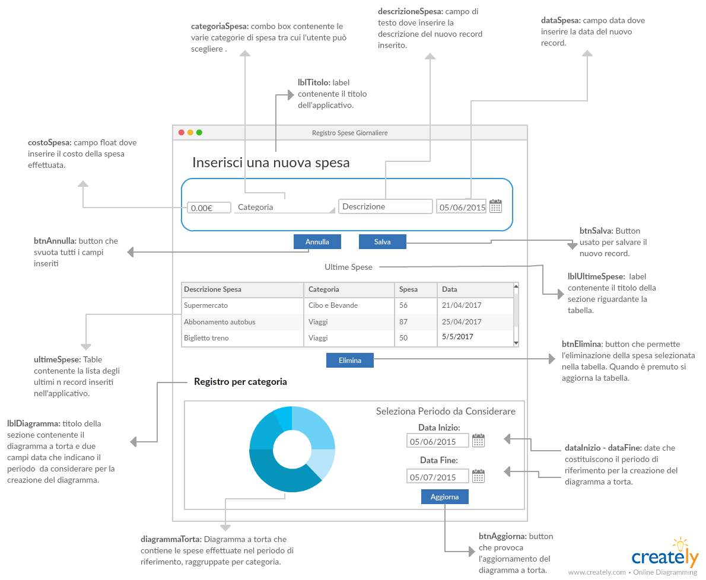

# Documento di analisi
## Registro delle spese giornaliere
Il progetto consiste nel realizzare un applicativo che consenta di tenere traccia delle spese effettuata dall'utente, in modo che l'utente stesso possa effettuare una gestione migliore delle proprie finanze o per altri fini.  

## Client GUI

## Vista dinamica
Inserimento di una Spesa  
1. L'Utente inserisce il **costo** della spesa effettuata.  
2. L'Utente preme **categoria**  
- il Sistema mostra la lista di Categorie tra cui l'utente può scegliere.  
3. L'Utente inserisce un'eventuale **descrizione**.  
4. L'Utente inserisce la **data**.  
5. IF l'Utente preme **Salva**  
- il Sistema archivia i dati, li carica nelle tabelle e svuota tutti i campi inseriti.  
6. IF l'Utente preme **Annulla**  
- il Sistema svuota tutti i campi inseriti.  

Eliminazione di una spesa  
1. L'Utente seleziona una riga dalla tabelle **Ultime Spese**.  
2. IF l'Utente preme **Elimina**  
- il Sistema svuota il record selezionato ed aggiorna la tabella **Ultime Spese**.    

Modifica periodo diagramma a torta  
1. L'Utente inserisce la **Data Inizio**  
2. L'Utente inserisce la **Data Fine**  
3. IF l'Utente preme **Aggiorna**  
- il Sistema aggiorna il diagramma a torta considerando il periodo selezionato.  

## File di configurazioni locale in XML
All'avvio il Sistema legge dal file di configurazione locale:  
1. Indirizzo e porta del Server di log a cui connettersi;  
2. L'indirizzo, la porta, il nome del database, il nome utente e la password da utilizzare per accedere al Database.  
3. Font, dimensione;   
4. Il numero di record massimo che devono apparire nella tabella Ultime Spese.

## Cache locale degli input
Alla chiusura l'applicativo salva su file binario tutti i parametri inseriti. All'avvio il sistema carica dal file binario tali dati.

## Base di dati
Il sistema archivia le seguenti informazioni su base di dati:  
- Tipologie di categorie di spese tra cui l'utente può scegliere;  
- Inserimento di una nuova spesa effettuata.      

All'avvio dell'applicativo, il Sistema legge dalla Base di Dati:  
- i record delle spese effettuate e li carica nella tabella **Ultime Spese**;  
- le categorie delle spese e li carica nel menù a tendina **categoria**.  

## File di log remoto in XML
Il Sistema invia un log per i seguenti eventi:  
1. Avvio dell'applicazione;   
2. Quando l'Utente preme il pulsante "Salva" per salvare una nuova spesa;  
3. Quando l'Utente preme il pulsante "Annulla" per svuotare tutti i campi inseriti;  
4. Quando l'Utente preme il pulsante "Elimina" per eliminare un record precedentemente inserito;  
5. Quando l'Utente seleziona una riga della tabella "Ultime Spese";  
6. Quando l'Utente preme il pulsante "Aggiorna" per aggiornare il grafico;  
7. Termine dell'applicazione.  
