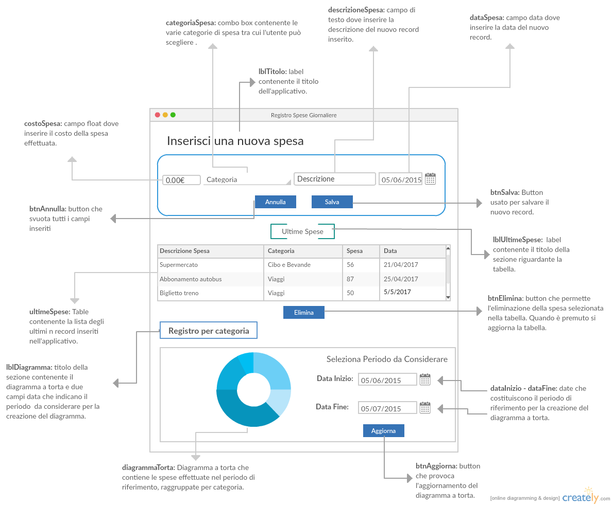

# Documento di analisi
## Registro delle spese giornaliere
Il progetto consiste nel realizzare un applicativo che consenta di tenere traccia delle spese effettuata dall'utente, in modo che l'utente stesso possa effettuare una gestione migliore delle proprie finanze o per altri fini.  

## Client GUI

## Vista dinamica
1. All'avvio dell'applicativo, il Sistema legge dalla Base di Dati i record delle spese effettuate e li carica nelle tabelle **ultimeSpesa** e **spesaPerCategoria**. Carica inoltre dalla Base di Dati le possibili categoriaSpesa che l'utente può selezionare.
2. L'Utente inserisce il **costoSpesa** della spesa effettuata.
3. L'Utente inserisce la **categoriaSpesa**.
4. L'Utente inserisce un'eventuale **descrizioneSpesa**.
5. L'Utente inserisce la **dataSpesa**.
6. IF l'Utente preme **btnSalva**
- il Sistema archivia i dati, li carica nelle tabelle e svuota tutti i campi inseriti.
7. IF l'Utente preme **btnAnnulla**
- il Sistema svuota tutti i campi inseriti.
8. IF l'Utente preme **eliminaSpesa**
- il Sistema svuota il record selezionato ed aggiorna la tabella **ultimeSpesa**, **spesaPerCategoria** e di conseguenza il **diagrammaTorta**.
9. L'applicativo contiene un diagramma a torta che rappresenta la spesa mensile effettuata dall'Utente, raggruppata per categoria.

## File di configurazioni locale in XML
All'avvio il Sistema legge dal file di configurazione locale:  
1. Indirizzo e porta del Server di log a cui connettersi;  
2. L'indirizzo, la porta, il nome utente e la password da utilizzare per accedere al Database.  
3. Font, dimensione, colore del background;   
4. Il numero di record massimo che devono apparire nella tabella ultimeSpese.

## Cache locale degli input
Alla chiusura l'applicativo salva su file binario tutti i parametri inseriti. All'avvio il sistema carica dal file binario tali dati.

## Base di dati
Il sistema archivia le seguenti informazioni su base di dati:  
- Tipologie di categorie di spese tra cui l'utente può scegliere(idCategoria, categoriaSpesa);  
- Inserimento di una nuova spesaEffettuata (idSpesa, costoSpesa, categoriaSpesa, descrizioneSpesa, dataSpesa).    

### Struttura tabelle Base di Dati
**Categoria**  
idCategoria: INT, AUTO_INCREMENT, PRIMARY KEY,  
categoriaSpesa: VARCHAR(45), NOT NULL  

La tabella Categoria contiene la lista di categorie di spesa tra cui l'utente può scegliere nella fase di inserimento di un nuovo record.

**Spese**  
idSpesa: INT, AUTO_INCREMENT, PRIMARY KEY,  
descrizioneSpesa: VARCHAR(45),  
costoSpesa: INT, NOT NULL,  
dataSpesa: DATE, NOT NULL,  
idCategoria: FOREIGN KEY  

La tabella Spese contiene le spese inserite dall'utente.
Ogni spesa è caratterizzata da un id numerico, una descrizione testuale, il costo e la data in cui la spesa è stata effettuata.

## File di log remoto in XML
Il Sistema invia un log per i seguenti eventi:  
1. Avvio dell'applicazione;   
2. Quando l'Utente preme il pulsante "Salva" per salvare una nuova spesa;  
3. Quando l'Utente preme il pulsante "Annulla" per svuotare tutti i campi inseriti;  
4. Quando l'Utente preme il pulsante "Elimina" per eliminare un record precedentemente inserito;  
5. Termine dell'applicazione.  
