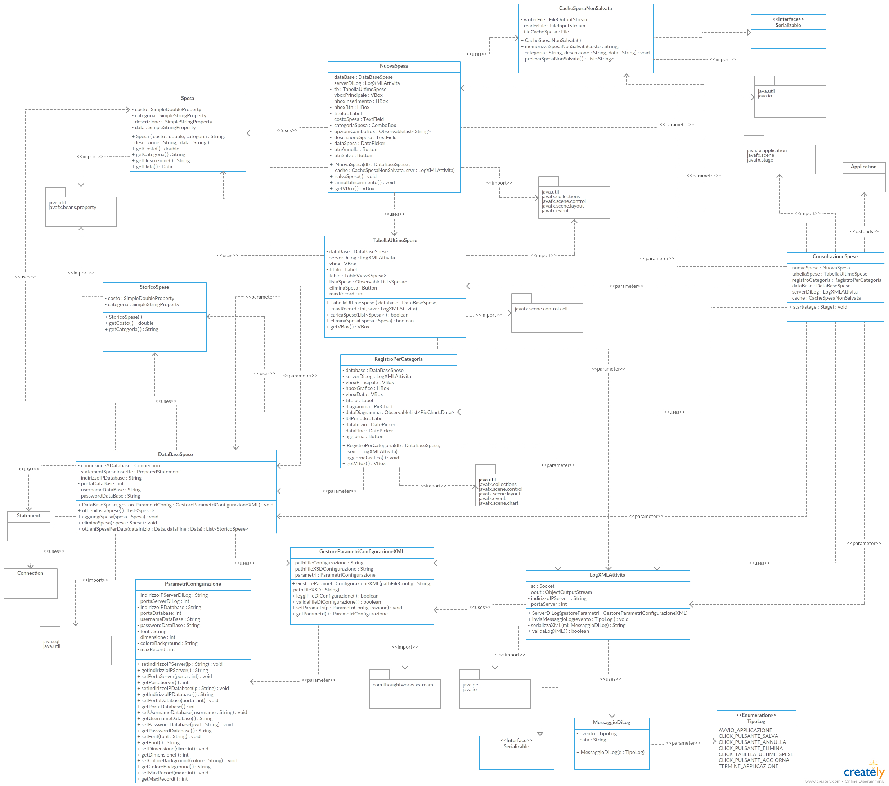

# Documento di progetto
## Registro delle spese giornaliere
Le classi dell'applicativo, visualizzabili graficamente nel diagramma UML, sono le seguenti:

### Classe Spesa 
Contiene le informazioni di ciascuna spesa inserita dall'utente.  
Ultilizzata dalla classe **DataBaseSpese** per ottenere la lista di spese effettuate dall'utente.

### Classe StoricoSpese
Contiene le informazioni delle spese inserite dall'utente, raggruppate per categoria.  
Ultilizzata dalla classe **DataBaseSpese** per ottenere la lista di spese per categoria, necessaria per la generazione del grafico.

### Classe DataBaseSpese
Esegue tutte le query sulla Base di Dati.

### Classe NuovaSpesa
Contiene la GUI relativa all'inserimento di una nuova spesa.

### Classe TabellaUltimeSpese
Contiene la GUI relativa alla visualizzazione delle spese effettuate e l'eliminazione di una o più di esse.

### Classe RegistroPerCategoria
Contiene il diagramma delle spese effettuate raggruppate per categoria da una certa data ad un'altra.

### Classe ParametriConfigurazione
Contiene i parametri di configurazione letti dal file di configurazione .xml locale dalla classe GestoreParametriConfigurazioneXML.  
Serializzata/Deserializzata tramite XMLStream.

### Classe GestoreParametriConfigurazioneXML
Legge i parametri di configurazione.  
Valida i parametri tramite XML Schema.

### Classe LogXMLAttivita
Gestisce il Socket di comunicazione con il Server di Log.
Serializzata tramite XStream.  
Validazione mediante XML Schema.  
Inviata alla classe ServerLogXMLAttivita.

### Classe CacheSpesaNonSalvata
Implementa Serializable.  
Si occupa di salvare e prelevare da file binario locale l'ultima spesa inserita dall'utente ma non salvata.

### Classe ConsultazioneSpese
Classe principale che aggiunge le tre parti dell'applicativo alla Scene, in modo da visualizzare la GUI completa in un'unica VBox.

# Diagramma UML

