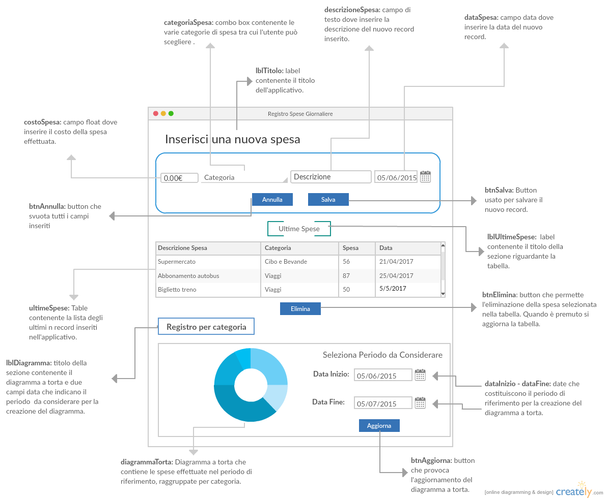
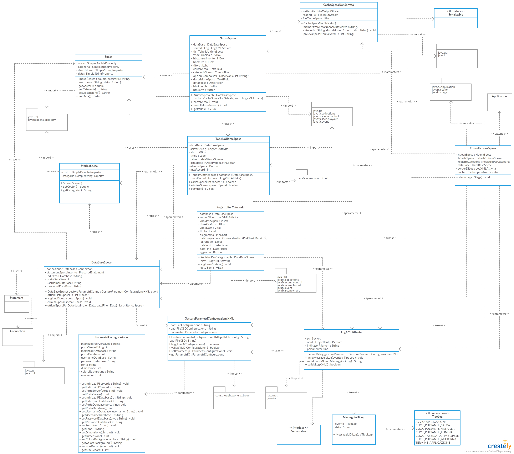

# 1 Introduzione
L'applicativo sviluppato, per l'esame di Programmazione Java, è un software di gestione della propria contabilità, che permette all'utente di monitorare le spese effettuate, in modo da tenere traccia delle proprie finanze e delle proprie uscite, per poi effettuare un'analisi del mese trascorso. È possibile sia visualizzare le ultime spese effettuate, all'interno di una tabella, sia un diagramma a torta che sintetizza le spese effettutate in un dato periodo, inserito dall'utente, raggruppate per categoria.  

# 2 Analisi
## Client GUI

## Vista dinamica
Inserimento di una Spesa  
1. L'Utente inserisce il **costo** della spesa effettuata.  
2. L'Utente preme **categoria**  
- il Sistema mostra la lista di Categorie tra cui l'utente può scegliere.  
3. L'Utente inserisce un'eventuale **descrizione**.  
4. L'Utente inserisce la **data**.  
5. IF l'Utente preme **Salva**  
- il Sistema archivia i dati, li carica nelle tabelle e svuota tutti i campi inseriti.  
6. IF l'Utente preme **Annulla**  
- il Sistema svuota tutti i campi inseriti.  

Eliminazione di una spesa  
1. L'Utente seleziona una riga dalla tabelle **Ultime Spese**.  
2. IF l'Utente preme **Elimina**  
- il Sistema svuota il record selezionato ed aggiorna la tabella **Ultime Spese**.    

Modifica periodo diagramma a torta  
1. L'Utente inserisce la **Data Inizio**  
2. L'Utente inserisce la **Data Fine**  
3. IF l'Utente preme **Aggiorna**  
- il Sistema aggiorna il diagramma a torta considerando il periodo selezionato.  

## File di configurazioni locale in XML
All'avvio il Sistema legge dal file di configurazione locale:  
1. Indirizzo e porta del Server di log a cui connettersi;  
2. L'indirizzo, la porta, il nome utente e la password da utilizzare per accedere al Database.  
3. Font, dimensione, colore del background;   
4. Il numero di record massimo che devono apparire nella tabella Ultime Spese.

## Cache locale degli input
Alla chiusura l'applicativo salva su file binario tutti i parametri inseriti. All'avvio il sistema carica dal file binario tali dati.

## Base di dati
Il sistema archivia le seguenti informazioni su base di dati:  
- Tipologie di categorie di spese tra cui l'utente può scegliere;
- Inserimento di una nuova spesa effettuata.      

All'avvio dell'applicativo, il Sistema legge dalla Base di Dati:  
- i record delle spese effettuate e li carica nella tabella **Ultime Spese**;  
- le categorie delle spese e li carica nel menù a tendina **categoria**.  

## File di log remoto in XML
Il Sistema invia un log per i seguenti eventi:  
1. Avvio dell'applicazione;   
2. Quando l'Utente preme il pulsante "Salva" per salvare una nuova spesa;  
3. Quando l'Utente preme il pulsante "Annulla" per svuotare tutti i campi inseriti;  
4. Quando l'Utente preme il pulsante "Elimina" per eliminare un record precedentemente inserito;  
5. Quando l'Utente seleziona una riga della tabella "Ultime Spese";  
6. Termine dell'applicazione.  

# 3 Progetto
## Registro delle spese giornaliere
Le classi dell'applicativo, visualizzabili graficamente nel diagramma UML, sono le seguenti:

### Classe Spesa 
Contiene le informazioni di ciascuna spesa inserita dall'utente.  
Ultilizzata dalla classe **DataBaseSpese** per ottenere la lista di spese effettuate dall'utente.

### Classe StoricoSpese
Contiene le informazioni delle spese inserite dall'utente, raggruppate per categoria.  
Ultilizzata dalla classe **DataBaseSpese** per ottenere la lista di spese per categoria, necessaria per la generazione del grafico.

### Classe DataBaseSpese
Esegue tutte le query sulla Base di Dati.

### Classe NuovaSpesa
Contiene la GUI relativa all'inserimento di una nuova spesa.

### Classe TabellaUltimeSpese
Contiene la GUI relativa alla visualizzazione delle spese effettuate e l'eliminazione di una o più di esse.

### Classe RegistroPerCategoria
Contiene il diagramma delle spese effettuate raggruppate per categoria da una certa data ad un'altra.

### Classe ParametriConfigurazione
Contiene i parametri di configurazione letti dal file di configurazione .xml locale dalla classe GestoreParametriConfigurazioneXML.  
Serializzata/Deserializzata tramite XMLStream.

### Classe GestoreParametriConfigurazioneXML
Legge i parametri di configurazione.  
Valida i parametri tramite XML Schema.

### Classe LogXMLAttivita
Gestisce il Socket di comunicazione con il Server di Log.
Serializzata tramite XStream.  
Validazione mediante XML Schema.  
Inviata alla classe ServerLogXMLAttivita.

### Classe CacheSpesaNonSalvata
Implementa Serializable.  
Si occupa di salvare e prelevare da file binario locale l'ultima spesa inserita dall'utente ma non salvata.

### Classe ConsultazioneSpese
Classe principale che aggiunge le tre parti dell'applicativo alla Scene, in modo da visualizzare la GUI completa in un'unica VBox.

# Diagramma UML

