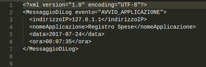
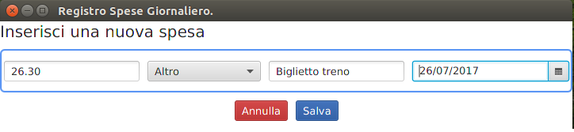

# Manuale Utente Registro Spese
Il presente manuale d'uso spiema come utilizzare il Server di Log e il Client del progetto.  
Il Server di Log non ha interfaccia grafica e può essere gestito utilizzando la linea di comando, mentre il Client ha un'interfaccia grafica.

## Server di Log
Prima di avviare il Server di Log assicurarsi che il file messaggioDiLog.xsd sia presente nella cartella in cui viene eseguito.  
Una volta avviato il Server di Log, esso rimarrà in attesa di nuovi messaggi di log, inviati in seguito all'avvio del Client. All'avvio del Client, ad esempio avremo:

Il file di log sarà, invece:

  
  Dopo varie operazioni effettuate, avremo questa situazione:

File di log (non completo):

## Client
Prima di avviare il Client assicurarsi che:
1. Il file parametri.xml sia presente nella cartella da cui viene eseguito;
2. Il file parametri.xsd sia presente nella cartella da cui viene eseguito;
3. Siano stati inseriti i parametri corretti nel file di configurazione parametri.xml.

Una volta avviato il Client, la finestra che verrà mostrata all'utente è la seguente:

### Inserimento di una spesa  
L'utente inserisce il costo, un'eventuale descrizione, la data della spesa e  sceglie tra le possibili categorie di spesa:
  

  
Se l'utente preme Annulla allora si svuotano tutti i campi e la spesa non viene salvata: 

altrimenti se preme Salva, questa viene salvata e mostrata nella tabella al disotto:

### Eliminazione di una spesa
L'utente seleziona una riga dalla tabella Ultime Spese:

  

Se l'utente preme Elimina il sistema rimuove la riga:

### Modifica diagramma
L'utente inserisce la Data Inizio e la Data Fine, del periodo che vuole prendere in considerazione: 

  
Se l'utente preme Aggiorna, il diagramma si aggiorna mostrando un resoconto delle spese raggruppate per categoria nel periodo di riferimento inserito:

## Script bat
Lo script RegistroSpese.bat può essere utilizzato su Windows per compilare i file sorgenti, raggruppati in due cartelle, e poi eseguirli.  
Di seguito gli screenshot relativi all'utilizzo dello script:   
Esecuzione script:

Avvio Server di Log:

Avvio Client:

